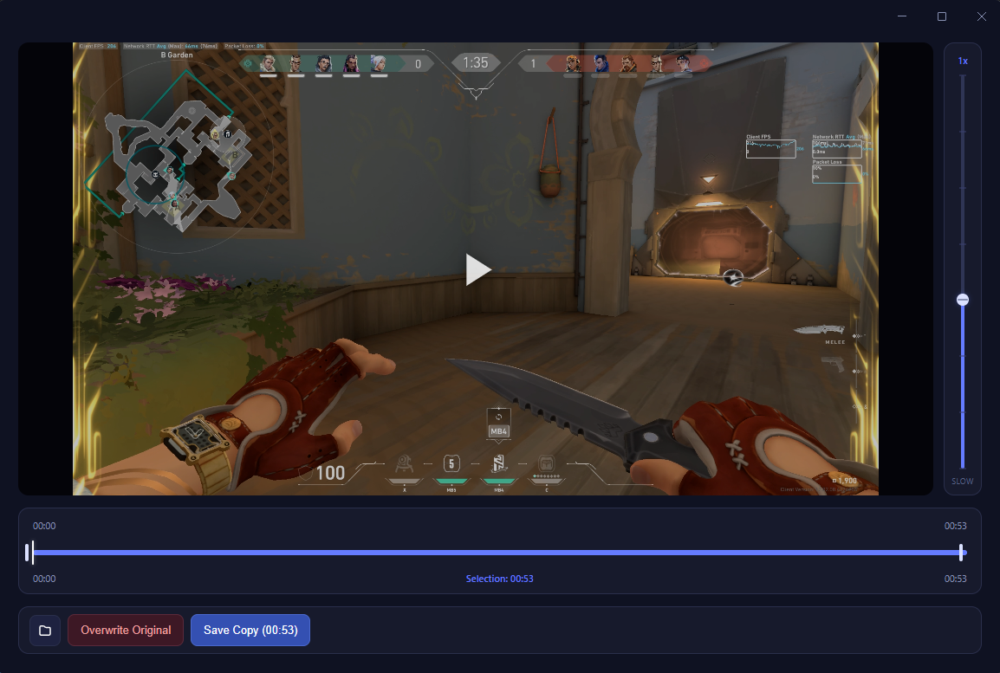
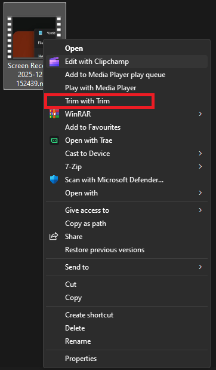

# Trim

A fast, minimal Windows desktop app for trimming videos. Select a portion of any video with a visual timeline, then save it as a new file or overwrite the original.

Built with Electron, React, and FFmpeg.

## Screenshots



Right-click any video in Windows Explorer to open it directly in Trim:



## Features

- **Visual timeline** with draggable handles to set trim start and end points
- **Three trim modes** — smart (tries fast copy first, falls back to re-encode), stream copy, or full re-encode
- **Overwrite or Save As** — replace the original file or export to a new one
- **Variable playback speed** from 0.25x to 16x
- **Volume control** with mute toggle
- **Drag & drop** — drag video files directly onto the app to open them
- **Recent files** — quick access to your 10 most recently opened videos
- **Automatic updates** — stay up-to-date with the latest features and fixes
- **Frame capture** — save the current video frame as a PNG with `S` or the camera button
- **Keyboard shortcuts** for efficient editing — press `?` to view all available shortcuts
- **Right-click integration** — open videos directly from Windows Explorer
- **Remember window size & position** — window layout is saved and restored between sessions
- **Supports** MP4, MOV, MKV, WebM, AVI, and M4V

## Keyboard Shortcuts

| Key | Action |
|---|---|
| `Space` | Play / Pause |
| `Left Arrow` | Step backward 1 frame |
| `Right Arrow` | Step forward 1 frame |
| `[` | Set trim start to current time |
| `]` | Set trim end to current time |
| `Home` | Jump to trim start |
| `End` | Jump to trim end |
| `S` | Save current frame as PNG |
| `I` | Toggle video info (resolution, frame rate) |
| `?` | Toggle keyboard shortcuts cheatsheet |
| `Esc` | Close video / go home |

## Installation

Download the latest installer from the [Releases](https://github.com/Yassine-Mhirsi/TRIM/releases) page and run the `.exe` setup.

## Development

### Prerequisites

- Node.js 20+
- npm

### Setup

```bash
git clone https://github.com/Yassine-Mhirsi/TRIM.git
cd TRIM
npm install
```

### Commands

```bash
npm run dev          # Start dev mode (Vite + Electron)
npm run build        # Typecheck + build renderer + build Electron
npm run dist         # Build Windows NSIS installer (.exe)
npm run lint         # ESLint
npm run typecheck    # TypeScript check without emit
```

## Tech Stack

- **Frontend:** React, TypeScript, Vite
- **Desktop:** Electron, electron-builder, electron-updater (NSIS installer with auto-updates)
- **Video:** FFmpeg / FFprobe via fluent-ffmpeg (bundled as static binaries)

## License

MIT
